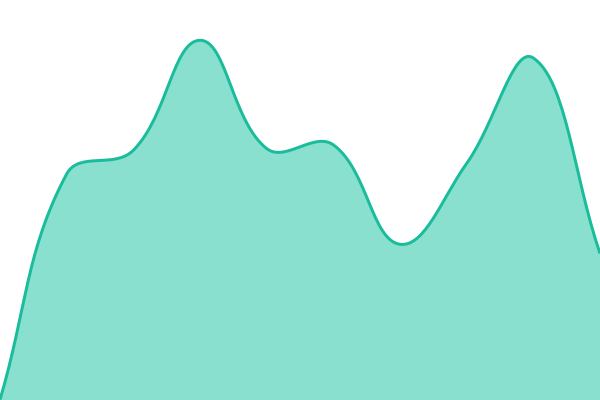
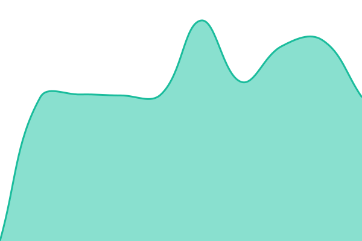
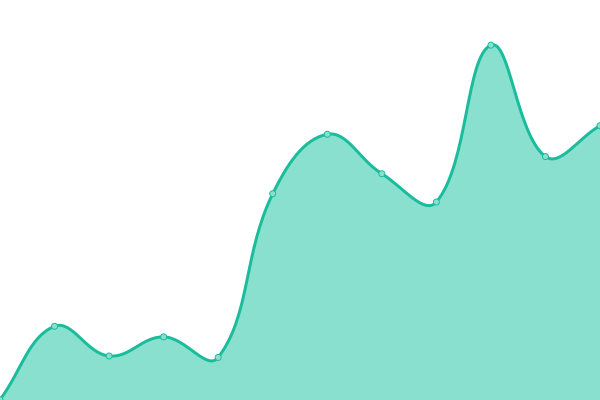

# [📈 Live Status](https://demo.upptime.js.org): <!--live status--> **🟩 All systems operational**

This repository contains the open-source uptime monitor and status page for [Jan Philip Wahle](https://jpwahle.com), powered by [Upptime](https://github.com/upptime/upptime).

With [Upptime](https://upptime.js.org), you can get your own unlimited and free uptime monitor and status page, powered entirely by a GitHub repository. We use [Issues](https://github.com/jpwahle/uptime/issues) as incident reports, [Actions](https://github.com/jpwahle/uptime/actions) as uptime monitors, and [Pages](https://demo.upptime.js.org) for the status page.

<!--start: status pages-->
<!-- This summary is generated by Upptime (https://github.com/upptime/upptime) -->
<!-- Do not edit this manually, your changes will be overwritten -->
<!-- prettier-ignore -->
| URL | Status | History | Response Time | Uptime |
| --- | ------ | ------- | ------------- | ------ |
|  [Conference Deadlines](https://www.conferencedeadlines.com/) | 🟩 Up | [conference-deadlines.yml](https://github.com/jpwahle/uptime/commits/HEAD/history/conference-deadlines.yml) | 

 245ms
     
 | 

<a href="https://jpwahle.github.io/uptime/history/conference-deadlines">100.00%</a>
    

|  [AI Cards](https://ai-cards.org/) | 🟩 Up | [ai-cards.yml](https://github.com/jpwahle/uptime/commits/HEAD/history/ai-cards.yml) | 

 240ms
     
 | 

<a href="https://jpwahle.github.io/uptime/history/ai-cards">100.00%</a>
    

|  [CiteAssist](https://citeassist.uni-goettingen.de/) | 🟩 Up | [cite-assist.yml](https://github.com/jpwahle/uptime/commits/HEAD/history/cite-assist.yml) | 

 980ms
     
 | 

<a href="https://jpwahle.github.io/uptime/history/cite-assist">100.00%</a>
    

|  [Check My Thesis](https://checkmythesis.com/) | 🟩 Up | [check-my-thesis.yml](https://github.com/jpwahle/uptime/commits/HEAD/history/check-my-thesis.yml) | 

 924ms
     
 | 

<a href="https://jpwahle.github.io/uptime/history/check-my-thesis">99.18%</a>
    

|  [Check My Thesis Supabase](https://supabase.checkmythesis.com/) | 🟩 Up | [check-my-thesis-supabase.yml](https://github.com/jpwahle/uptime/commits/HEAD/history/check-my-thesis-supabase.yml) | 

 792ms
     
 | 

<a href="https://jpwahle.github.io/uptime/history/check-my-thesis-supabase">91.28%</a>
    

|  [Check My Thesis API](https://api.checkmythesis.com/health) | 🟩 Up | [check-my-thesis-api.yml](https://github.com/jpwahle/uptime/commits/HEAD/history/check-my-thesis-api.yml) | 

 724ms
     
 | 

<a href="https://jpwahle.github.io/uptime/history/check-my-thesis-api">98.97%</a>
    

|  [WK Solutions](https://wksolutions.de/) | 🟩 Up | [wk-solutions.yml](https://github.com/jpwahle/uptime/commits/HEAD/history/wk-solutions.yml) | 

 965ms
     
 | 

<a href="https://jpwahle.github.io/uptime/history/wk-solutions">99.18%</a>
    

<!--end: status pages-->

[**Visit our status website →**](https://demo.upptime.js.org)

## 📄 License

- Powered by: [Upptime](https://github.com/upptime/upptime)
- Code: [MIT](./LICENSE) © [Anand Chowdhary](https://anandchowdhary.com), supported by [Pabio](https://pabio.com)
- Data in the `./history` directory: [Open Database License](https://opendatacommons.org/licenses/odbl/1-0/)
