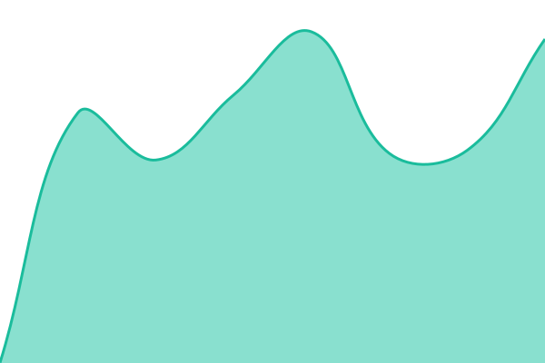
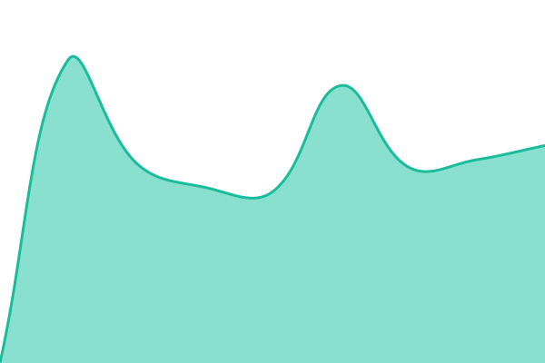
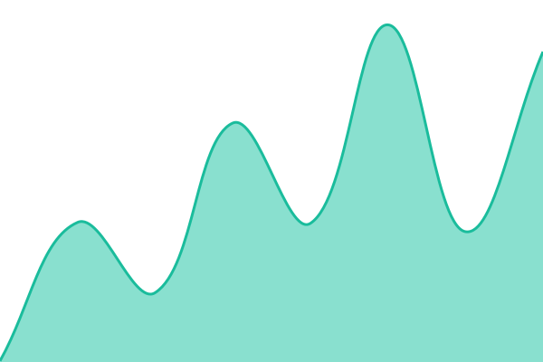

# [📈 Live Status](https://jpwahle.github.io/uptime): <!--live status--> **🟩 All systems operational**

This repository contains the open-source uptime monitor and status page for [Jan Philip Wahle](https://jpwahle.com) and [Lars Kaesberg](https://larskaesberg.de), powered by [Upptime](https://github.com/upptime/upptime).

With [Upptime](https://upptime.js.org), you can get your own unlimited and free uptime monitor and status page, powered entirely by a GitHub repository. We use [Issues](https://github.com/jpwahle/uptime/issues) as incident reports, [Actions](https://github.com/jpwahle/uptime/actions) as uptime monitors, and [Pages](https://jpwahle.github.io/uptime) for the status page.

<!--start: status pages-->
<!-- This summary is generated by Upptime (https://github.com/upptime/upptime) -->
<!-- Do not edit this manually, your changes will be overwritten -->
<!-- prettier-ignore -->
| URL | Status | History | Response Time | Uptime |
| --- | ------ | ------- | ------------- | ------ |
|  [Check Your Draft](https://checkyourdraft.com/) | 🟩 Up | [check-your-draft.yml](https://github.com/jpwahle/uptime/commits/HEAD/history/check-your-draft.yml) | 

 829ms
     
 | 

<a href="https://jpwahle.github.io/history/check-your-draft">100.00%</a>
    

|  [Check Your Draft API](https://api.checkyourdraft.com/health) | 🟩 Up | [check-your-draft-api.yml](https://github.com/jpwahle/uptime/commits/HEAD/history/check-your-draft-api.yml) | 

 518ms
     
 | 

<a href="https://jpwahle.github.io/history/check-your-draft-api">100.00%</a>
    

|  [WK Solutions](https://wksolutions.de/) | 🟩 Up | [wk-solutions.yml](https://github.com/jpwahle/uptime/commits/HEAD/history/wk-solutions.yml) | 

 716ms
     
 | 

<a href="https://jpwahle.github.io/history/wk-solutions">100.00%</a>
    

|  [Swipe Photos App](https://www.swipephotos.com/) | 🟩 Up | [swipe-photos-app.yml](https://github.com/jpwahle/uptime/commits/HEAD/history/swipe-photos-app.yml) | 

 753ms
     
 | 

<a href="https://jpwahle.github.io/history/swipe-photos-app">100.00%</a>
    

|  [Dejavue](https://dejavue.app/) | 🟩 Up | [dejavue.yml](https://github.com/jpwahle/uptime/commits/HEAD/history/dejavue.yml) | 

 794ms
     
 | 

<a href="https://jpwahle.github.io/history/dejavue">100.00%</a>
    

|  [Bloatless](https://www.bloatless.app/) | 🟩 Up | [bloatless.yml](https://github.com/jpwahle/uptime/commits/HEAD/history/bloatless.yml) | 

 672ms
     
 | 

<a href="https://jpwahle.github.io/history/bloatless">100.00%</a>
    

|  [Conference Deadlines](https://www.conferencedeadlines.com/) | 🟩 Up | [conference-deadlines.yml](https://github.com/jpwahle/uptime/commits/HEAD/history/conference-deadlines.yml) | 

 783ms
     
 | 

<a href="https://jpwahle.github.io/history/conference-deadlines">100.00%</a>
    

|  [AI Cards](https://ai-cards.org/) | 🟩 Up | [ai-cards.yml](https://github.com/jpwahle/uptime/commits/HEAD/history/ai-cards.yml) | 

 220ms
     
 | 

<a href="https://jpwahle.github.io/history/ai-cards">100.00%</a>
    

|  [CiteAssist](https://citeassist.uni-goettingen.de/) | 🟩 Up | [cite-assist.yml](https://github.com/jpwahle/uptime/commits/HEAD/history/cite-assist.yml) | 

 1023ms
     
 | 

<a href="https://jpwahle.github.io/history/cite-assist">100.00%</a>
    

|  [Apple Mail AI Plugin](https://jpwahle.github.io/apple-mail-ai-plugin/) | 🟩 Up | [apple-mail-ai-plugin.yml](https://github.com/jpwahle/uptime/commits/HEAD/history/apple-mail-ai-plugin.yml) | 

 167ms
     
 | 

<a href="https://jpwahle.github.io/history/apple-mail-ai-plugin">100.00%</a>
    

|  [Discord Emailbot](https://emailbotstats.larskaesberg.de) | 🟩 Up | [discord-emailbot.yml](https://github.com/jpwahle/uptime/commits/HEAD/history/discord-emailbot.yml) | 

 474ms
     
 | 

<a href="https://jpwahle.github.io/history/discord-emailbot">100.00%</a>
    

|  [AI Mensa App](https://mensa.larskaesberg.de) | 🟩 Up | [ai-mensa-app.yml](https://github.com/jpwahle/uptime/commits/HEAD/history/ai-mensa-app.yml) | 

 226ms
     
 | 

<a href="https://jpwahle.github.io/history/ai-mensa-app">100.00%</a>
    

|  [SupplementPrice](https://supplementprice.app/) | 🟩 Up | [supplement-price.yml](https://github.com/jpwahle/uptime/commits/HEAD/history/supplement-price.yml) | 

 2214ms
     
 | 

<a href="https://jpwahle.github.io/history/supplement-price">100.00%</a>
    

|  [OfficeSquats](https://officesquats.app/) | 🟩 Up | [office-squats.yml](https://github.com/jpwahle/uptime/commits/HEAD/history/office-squats.yml) | 

 870ms
     
 | 

<a href="https://jpwahle.github.io/history/office-squats">100.00%</a>
    

<!--end: status pages-->

[**Visit our status website →**](https://demo.upptime.js.org)

## 📄 License

- Powered by: [Upptime](https://github.com/upptime/upptime)
- Code: [MIT](./LICENSE) © [Anand Chowdhary](https://anandchowdhary.com), supported by [Pabio](https://pabio.com)
- Data in the `./history` directory: [Open Database License](https://opendatacommons.org/licenses/odbl/1-0/)
